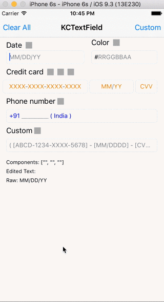

# KCMaskTextField

## Installation

Download/Clone this project and copy KCMaskTextField.swift file to your project.

## Usage

### Set format & mask

`func setFormat(format:String, mask:String)`

Example :

setFormat("MM/DD/YY", mask: "dd/dd/dd")

setFormat("[ XXXX-XXXX-XXXX-XXXX ]", mask: "\*\*dddd\*dddd\*dddd\*dddd\*\*")

mask can take any of the following values for each character.

d	: Number, decimal number from 0 to 9

D	: Any symbol, except decimal number

a	: Alphabetic symbol, a-Z

A	: Not an alphabetic symbol

c   : Alphanumeric a-z,0-9

C   : Not an alphanumeric symbol

h	: Hexadecimal symbol

.	: Corresponds to any symbol (default)

*	: Non editable field

### Case 

`@IBInspectable var caseString:String`

Example :

format : ABCD-EFGH-IJKL

mask   : aaaa-aaaa-aaaa

case   : AAAA-aaaa-AaAa

----------------------------

output : ABCD-abcd-AbCd

You can provide case value for each character in the format or it can take just one character which can either be 'a' or 'A' and it will effect the whole input string.

a - Small case

A - Upper case 

### Delimiter color

`@IBInspectable var delimiterColor:UIColor`

Changes the color of Non-ediatble characters. ex: /,/ in DD/MM/YY

### Format color

`@IBInspectable var formatColor:UIColor`

Changes the color of format characters. ex: DD,MM and YY in DD/MM/YY

### Edited Text Color

`@IBInspectable var editableColor:UIColor`

Changes the color of edited characters. ex: 22,01,17 in 22/01/17

